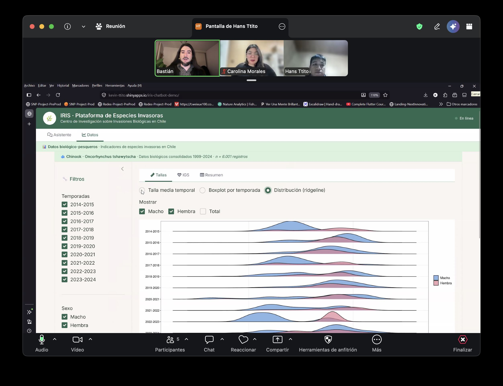
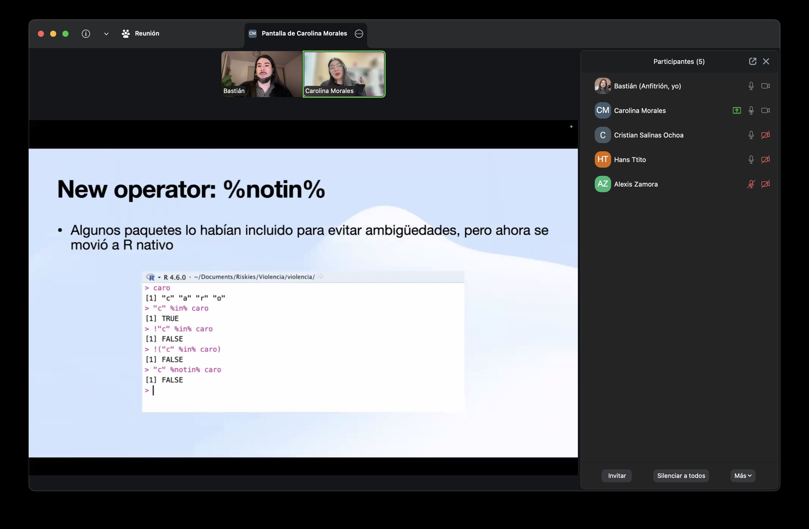
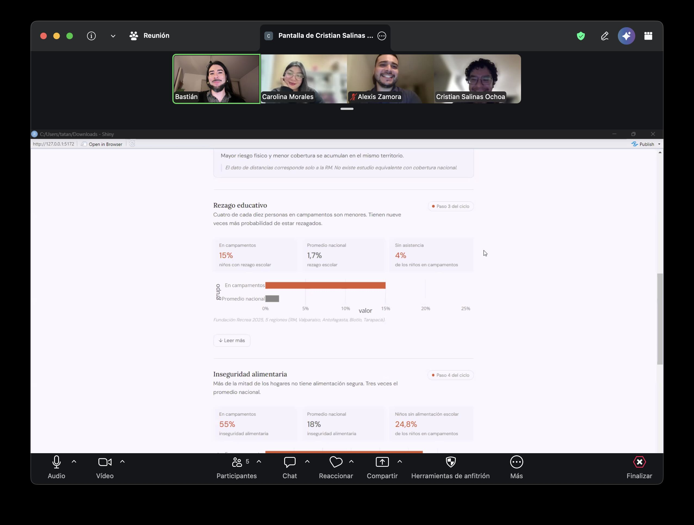
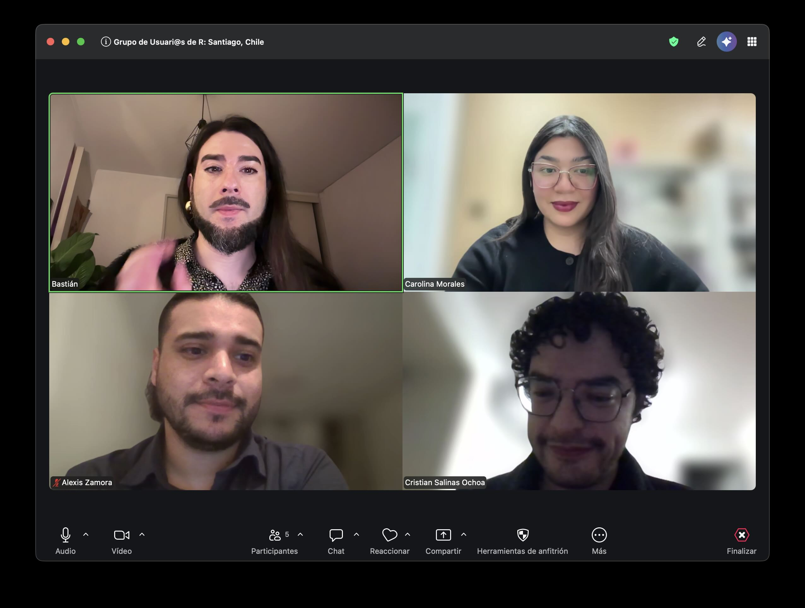

En esta **tercera** reunión online de usuarios/as de R conversamos sobre **desigualdad social, biología, inteligencia artificial**, y más! 

Pudimos explorar varias plataformas interactivas desarrolladas con R y dar comentarios y críticas constructivas, conversando también sobre el uso que hacemos de los modelos de lenguaje o inteligencia artificial para ayudarnos en el desarrollo de nuestros proyectos. 

También pudimos revisar noticias recientes sobre la comunidad de R, como las actualizaciones de R a su versión 4.6, o de `{dplyr}` a su versión 1.2.0.

[Nos vemos en la junta del próximo mes](/participa.html), así que [atención a nuestras redes sociales](/about.html) para mantenernos en contacto! ✨

::: {.galeria}
{.fotito .lightbox group="galeria"}
{.fotito .lightbox group="galeria"}
{.fotito .lightbox group="galeria"}
{.fotito .lightbox group="galeria"}
:::