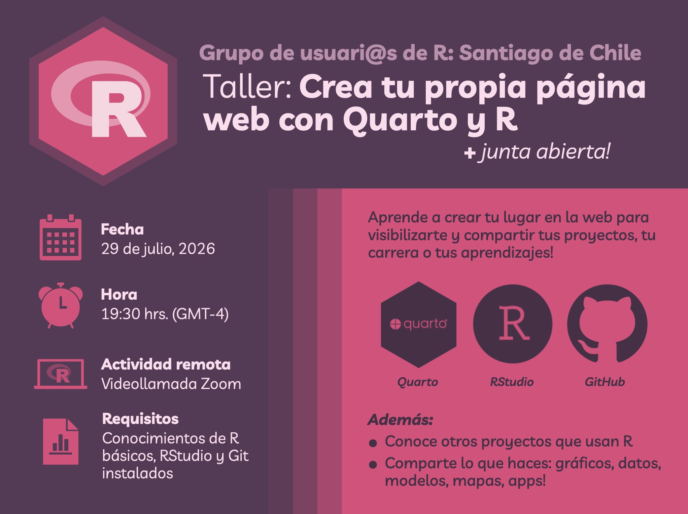

Para la reunión mensual del mes de julio, el grupo de usuarias/os de R de Santiago de Chile les invita a un **taller**! 

¡Los dejamos cordialmente invitados a una nueva reunión de _R Users Santiago_! 

En esta edición especial tendremos el taller **Crea tu página web con Quarto y R**, dictado por [Bastián Olea Herrera](https://bastianolea.rbind.io).

Durante el taller aprenderás a crear una página web utilizando Quarto, una herramienta sencilla y potente que te permitirá mostrar tu trabajo, proyectos, publicaciones, portafolio y mucho más, y también veremos cómo subir esta página a tu propio sitio gracias a GitHub Pages, para que cualquier persona pueda verla.

 Antes de la reunión, asegúrate de tener:

* **R** y **RStudio** instalados ([ver instrucciones aquí](https://bastianolea.github.io/aprende_r/#obtener-r))
* El paquete de R **Quarto** instalado: `install.packages("quarto")`
* Una cuenta de **GitHub** creada, ya que la utilizaremos para publicar nuestra página web!

¡Nos vemos el miércoles 29 de julio! 

### Taller de julio:
- 29 de julio de 2026, 19:30 hrs. (Santiago), online

[Conéctate a la reunión por Zoom en este enlace](https://us06web.zoom.us/j/87800697219?pwd=zhMlOjGnAkG001JbO1S1oMVkdgU63m.1
), y/o agrégala a tu calendario:

<!-- botón de google calendar --->
:::{.boton}
<a href = "https://calendar.app.google/sdBpWQPjWXvHT6qy5" 
target = "_blank">

 Agregar a Google Calendar

</a>
:::

<!-- botón de descargar calendario --->
:::{.boton}
<a href="evento_r_chile.ics" 
download="evento_r_chile.ics">

 Descargar para Calendario

</a>
:::

Nos puedes ayudar difundiendo el aviso de la reunión [en LinkedIn ](https://www.linkedin.com/company/santiagorusers) y en [Twitter/X ](https://x.com/SantiagoRusers/)

Por mientras puedes unirte al **chat grupal** para conversar y ayudar a coordinar la reunión!

  <a href = "https://join.slack.com/t/santiagorusers/shared_invite/zt-3tzmsdyat-gNAUz5mjPij0xFgNLtXeKA" 
  style="text-decoration: none; color: #FDF4F8;" target = "_blank">
  
   Únete al chat grupal en Slack
    
  </a>

<!---
::: {style="margin-top: 42px;"}

:::
--->

_Recuerda que al participar en las reuniones de la comunidad de usuarias y usuarios de R, estás aceptando el [código de conducta](https://ropensci.org/es/código-de-conducta/), que busca asegurar un espacio seguro e inclusivo para todas las personas._